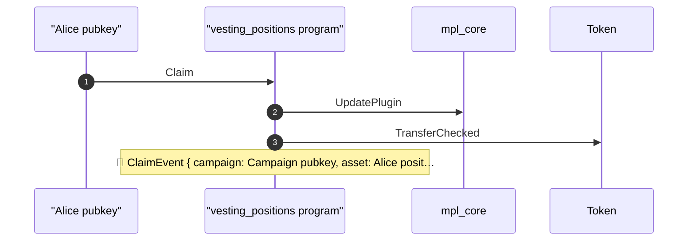
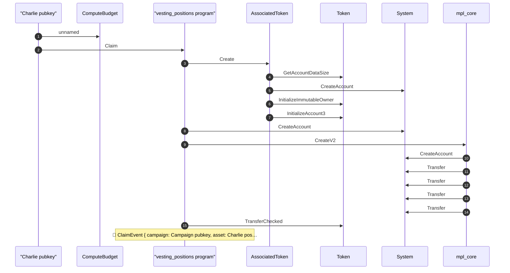
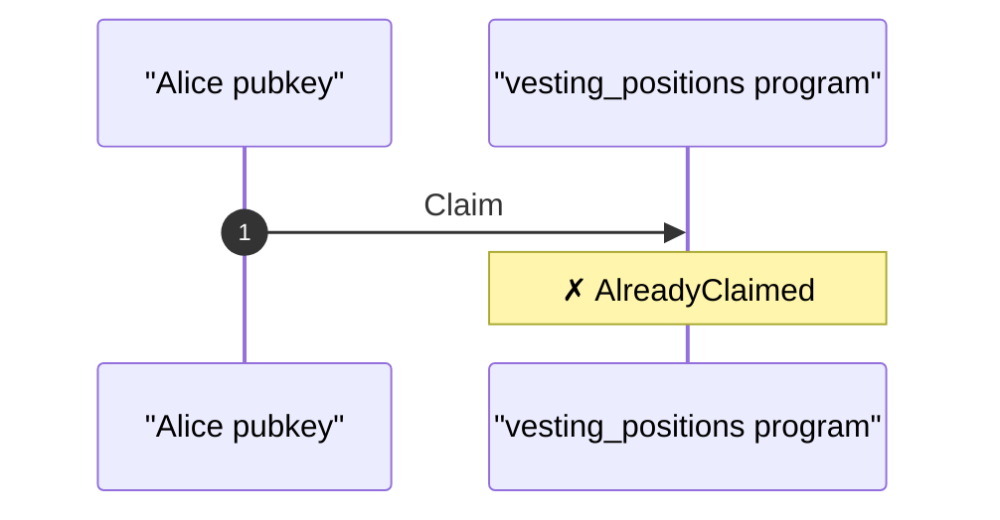
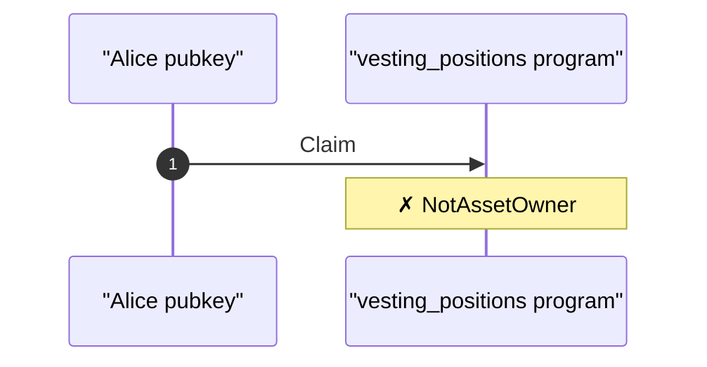
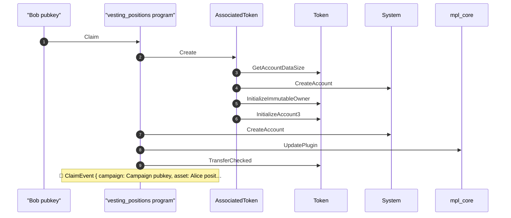
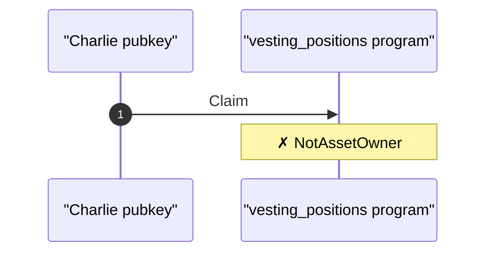
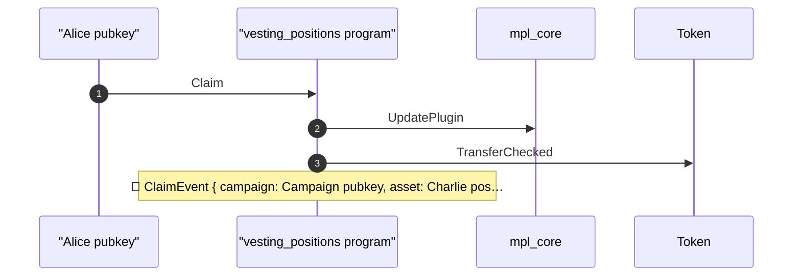

## Full vesting lifecycle — PASS

> demonstrate whole vesting life cycle including position transfers

**actors pubkeys**

| field | value |
|---|---|
| campaign creator | BUTN6L99gZasTEZ8onMJCC1NkoxXkpfoZU7EkcgWFyJw |
| alice | 4wQQJM9LNuhinieNAqmHuPCm8LXDTVfhx84P32nAVE9P |
| bob | ErV63ApqLgh1Je5PdiVj6kzwkKJmLjKV41QoN9U4BNag |
| charlie | H87xi4CUqrUPXzppV3jotTmre6DyR5pCaMk5bKQQBFTg |

**PDAs**

| field | value |
|---|---|
| campaign | BAdhTbCM1gZzkXUS9BNXhFcJ2GrMp33N4a53pNNbv2Mw |
| campaign vault | h6b4LrA7UDHfLg57TJYgU7mZjqQZYRjovQ7kGLMxZFH |

### Campaign initialized

- [x] campaign creator match: `true`
- [x] campaign schedule match: `true`
- [x] merkle root and deposit match: `true`

**campaign settings**

| field | value |
|---|---|
| creator | campaign creator pubkey |
| start (unix) | 1700086400 |
| end (unix) | 1702678400 |
| grace period (sec) | 604800 |
| cliff duration (sec) | 86400 |
| cliff release (bps) | 1000 |
| total deposit | 10000000000000 |
| transferable | true |

### Alice first claim

**Collection & Assets**

| field | value |
|---|---|
| NFT Collection for this campaign | 6nUiVzrpjwKJJ99KW4vMwjsGK3SoMQuWXFD3hcMKzQw6 |
| Alice position NFT | 993tWnLHDL7DHApupk2U5cZbjznbX3udkHFKsGHu5uJ5 |
| Charlie position NFT | C2PE7PrPyumsaX6cDZJZZmQm9UoicWjSyoP5a69vzr8E |

- [x] alice and charlie have different allocations: `true`

| Observation | Before | After | What it means |
|---|---|---|---|
| Alice's token balance, after the cliff claim | `0` | `100000000000` | Alice received 10% of her allocation |

- [x] alice position nft exists: `true`
- [x] alice position nft owner is alice: `4wQQJM9LNuhinieNAqmHuPCm8LXDTVfhx84P32nAVE9P`

### Alice subsequent claim without providing any proof

**subsequent claim**

| field | value |
|---|---|
| claimant | Alice pubkey |
| auth | position NFT (no proofs) |
| asset | Alice position NFT |
| linear % | 50 |
| timestamp (unix) | 1701425600 |
| balance before | 100000000000 |
| incremental release | 450000000000 |

| Observation | Before | After | What it means |
|---|---|---|---|
| Alice balance after second claim at 50% elapsed time | `100000000000` | `550000000000` | Alice received the expected amount for 50% elapsed time |

### Charlie first claim at 50% elapsed

Charlie opens a separate position with his own merkle leaf and allocation

**first claim**

| field | value |
|---|---|
| claimant | Charlie pubkey |
| auth | merkle proofs + allocation |
| asset | Charlie position NFT |
| allocation | 2000000000000 |
| timestamp (unix) | 1701425600 |

| Observation | Before | After | What it means |
|---|---|---|---|
| Charlie's token balance after first claim | `0` | `1100000000000` | Charlie received cliff + linear vesting through 50% of the window |

- [x] charlie position nft exists: `true`
- [x] charlie position nft owner is charlie: `H87xi4CUqrUPXzppV3jotTmre6DyR5pCaMk5bKQQBFTg`

### NFT transfer to Bob

**transfer**

| field | value |
|---|---|
| from | Alice pubkey |
| to | Bob pubkey |
| recipient whitelisted | false |
| asset | Alice position NFT |

| Observation | Before | After | What it means |
|---|---|---|---|
| Alice's position ownership | `"Alice pubkey"` | `"Bob pubkey"` | Bob is now the owner of Alice's vesting position |

### Alice replays merkle proofs after transferring the NFT

The program should reject minting a second vesting position for the same proofs

**attack**

| field | value |
|---|---|
| vector | first claim with valid merkle proofs after transfer |
| goal | mint a second NFT / reclaim allocation (infinite money trick) |
| alice owns nft | false |
| expected error | AlreadyClaimed |

- [x] alice no longer owns the nft: `true`
- [x] claim receipt still bound to alice: `4wQQJM9LNuhinieNAqmHuPCm8LXDTVfhx84P32nAVE9P`

### Alice subsequent claim after transferring her position

Former owners cannot claim via their old receipt or whitelist status — NFT ownership is required

**attack**

| field | value |
|---|---|
| vector | subsequent claim on transferred position |
| claimant | Alice pubkey |
| asset owner | Bob pubkey |
| auth attempted | no proofs (former owner) |
| expected error | NotAssetOwner |

### Bob claims via NFT ownership

**subsequent claim**

| field | value |
|---|---|
| claimant | Bob pubkey |
| whitelisted | false |
| asset | Alice position NFT |
| auth | NFT ownership only (no merkle proofs) |
| linear % | 75 |
| timestamp (unix) | 1702052000 |
| claimed so far | 550000000000 |
| expected release | 225000000000 |

Bob was never whitelisted; NFT ownership alone authorizes the subsequent claim

| Observation | Before | After | What it means |
|---|---|---|---|
| Bob's token balance after claiming with Alice's position | `0` | `225000000000` | Bob claims vested tokens from Alice's allocation because he owns her position |

- [x] alice position nft owner is still bob: `ErV63ApqLgh1Je5PdiVj6kzwkKJmLjKV41QoN9U4BNag`

### Charlie partial claim before transferring to Alice

**subsequent claim**

| field | value |
|---|---|
| claimant | Charlie pubkey |
| asset | Charlie position NFT |
| auth | position NFT (no proofs) |
| linear % | 75 |
| timestamp (unix) | 1702052000 |
| balance before | 1100000000000 |
| incremental release | 450000000000 |

| Observation | Before | After | What it means |
|---|---|---|---|
| Charlie's token balance after partial claim | `1100000000000` | `1550000000000` | Charlie claimed more vested tokens before transferring the NFT |

### Charlie transfers position to Alice

**transfer**

| field | value |
|---|---|
| from | Charlie pubkey |
| to | Alice pubkey |
| recipient whitelisted | true |
| asset | Charlie position NFT |
| allocation on nft | 2000000000000 |

Asset PDA and original_recipient stay bound to Charlie; only mpl-core owner changes

| Observation | Before | After | What it means |
|---|---|---|---|
| Charlie's position ownership | `"Charlie pubkey"` | `"Alice pubkey"` | Alice now holds Charlie's vesting position NFT |

- [x] alice and charlie positions are distinct nfts: `true`

### Charlie subsequent claim after transferring his position

**attack**

| field | value |
|---|---|
| vector | subsequent claim on transferred position |
| claimant | Charlie pubkey |
| asset owner | Alice pubkey |
| auth attempted | no proofs (former owner, still whitelisted) |
| expected error | NotAssetOwner |

### Alice claims Charlie's allocation via NFT ownership

**subsequent claim**

| field | value |
|---|---|
| claimant | Alice pubkey |
| whitelisted for own leaf | true |
| asset | Charlie position NFT |
| auth | NFT ownership (Charlie's position, not Alice's leaf) |
| allocation on nft | 2000000000000 |
| alice own allocation | 1000000000000 |
| linear % | 90 |
| timestamp (unix) | 1702427840 |
| charlie claimed so far | 1550000000000 |
| expected release | 270000000000 |

Alice is whitelisted for her own leaf, but this claim uses Charlie's allocation stored on his NFT — not Alice's merkle proofs

| Observation | Before | After | What it means |
|---|---|---|---|
| Alice token balance increment from Charlie's position | `550000000000` | `820000000000` | Alice received Charlie's vested tokens, not a replay of her own allocation |

- [x] increment matches charlie allocation math: `270000000000`
- [x] increment uses charlie allocation not alice own leaf: `true`
- [x] charlie position nft owner is alice: `4wQQJM9LNuhinieNAqmHuPCm8LXDTVfhx84P32nAVE9P`
- [x] alice still owns her original position via bob: `ErV63ApqLgh1Je5PdiVj6kzwkKJmLjKV41QoN9U4BNag`

**Structured logs**

````text
### Act 1 — alice first claim
```console
Transaction  signers=[Alice pubkey]
├── ComputeBudget [1] ✓ (no cu)
└── vesting_positions program::Claim [1] ✓ 180917cu  signer=Alice pubkey
    │ 🔔 ClaimEvent
    │      campaign:           Campaign pubkey,
    │      asset:              Alice position NFT,
    │      claimant:           Alice pubkey,
    │      original_recipient: Alice pubkey,
    │      amount:             100000000000,
    │      claimed_so_far:     100000000000,
    │      timestamp:          1700172800
    ├── AssociatedToken::Create [2] ✓ 20389cu
    │   ├── Token::GetAccountDataSize [3] ✓ 1595cu
    │   ├── System::CreateAccount [3] ✓ (no cu)
    │   ├── Token::InitializeImmutableOwner [3] ✓ 1405cu
    │   └── Token::InitializeAccount3 [3] ✓ 4214cu
    ├── System::CreateAccount [2] ✓ (no cu)
    ├── mpl_core::CreateV2 [2] ✓ 29916cu
    │   ├── System::CreateAccount [3] ✓ (no cu)
    │   ├── System::Transfer [3] ✓ (no cu)
    │   ├── System::Transfer [3] ✓ (no cu)
    │   ├── System::Transfer [3] ✓ (no cu)
    │   └── System::Transfer [3] ✓ (no cu)
    └── Token::TransferChecked [2] ✓ 6174cu
Compute Units (this run): 181067
Legend (3):
  Alice pubkey              = 4wQQJM9LNuhinieNAqmHuPCm8LXDTVfhx84P32nAVE9P
  vesting_positions program = 4hAzFNAWaGZ5YpbRkSsfLNnQ3JXenkb3hAQ19nL7vTH3
  mpl_core                  = CoREENxT6tW1HoK8ypY1SxRMZTcVPm7R94rH4PZNhX7d
```

### Act 2 — alice subsequent claim
```console
── vesting_positions program::Claim ────────────────────────
Transaction  signers=[Alice pubkey]
└── vesting_positions program::Claim [1] ✓ 83989cu  signer=Alice pubkey
    │ 🔔 ClaimEvent
    │      campaign:           Campaign pubkey,
    │      asset:              Alice position NFT,
    │      claimant:           Alice pubkey,
    │      original_recipient: Alice pubkey,
    │      amount:             450000000000,
    │      claimed_so_far:     550000000000,
    │      timestamp:          1701425600
    ├── mpl_core::UpdatePlugin [2] ✓ 20791cu
    └── Token::TransferChecked [2] ✓ 6174cu
Compute Units (this run): 83989
Legend (3):
  vesting_positions program = 4hAzFNAWaGZ5YpbRkSsfLNnQ3JXenkb3hAQ19nL7vTH3
  Alice pubkey              = 4wQQJM9LNuhinieNAqmHuPCm8LXDTVfhx84P32nAVE9P
  mpl_core                  = CoREENxT6tW1HoK8ypY1SxRMZTcVPm7R94rH4PZNhX7d
```

### Act 3 — charlie first claim
```console
Transaction  signers=[Charlie pubkey]
├── ComputeBudget [1] ✓ (no cu)
└── vesting_positions program::Claim [1] ✓ 192900cu  signer=Charlie pubkey
    │ 🔔 ClaimEvent
    │      campaign:           Campaign pubkey,
    │      asset:              Charlie position NFT,
    │      claimant:           Charlie pubkey,
    │      original_recipient: Charlie pubkey,
    │      amount:             1100000000000,
    │      claimed_so_far:     1100000000000,
    │      timestamp:          1701425600
    ├── AssociatedToken::Create [2] ✓ 24889cu
    │   ├── Token::GetAccountDataSize [3] ✓ 1595cu
    │   ├── System::CreateAccount [3] ✓ (no cu)
    │   ├── Token::InitializeImmutableOwner [3] ✓ 1405cu
    │   └── Token::InitializeAccount3 [3] ✓ 4214cu
    ├── System::CreateAccount [2] ✓ (no cu)
    ├── mpl_core::CreateV2 [2] ✓ 29612cu
    │   ├── System::CreateAccount [3] ✓ (no cu)
    │   ├── System::Transfer [3] ✓ (no cu)
    │   ├── System::Transfer [3] ✓ (no cu)
    │   ├── System::Transfer [3] ✓ (no cu)
    │   └── System::Transfer [3] ✓ (no cu)
    └── Token::TransferChecked [2] ✓ 6174cu
Compute Units (this run): 193050
Legend (3):
  Charlie pubkey            = H87xi4CUqrUPXzppV3jotTmre6DyR5pCaMk5bKQQBFTg
  vesting_positions program = 4hAzFNAWaGZ5YpbRkSsfLNnQ3JXenkb3hAQ19nL7vTH3
  mpl_core                  = CoREENxT6tW1HoK8ypY1SxRMZTcVPm7R94rH4PZNhX7d
```

### Act 4 — merkle replay rejected
```console
── vesting_positions program::Claim ────────────────────────
Transaction  signers=[Alice pubkey]
└── vesting_positions program::Claim [1] ✗ 22067cu  signer=Alice pubkey
    └── Error: AlreadyClaimed
Error: InstructionError(0, Custom(6012))
Compute Units (this run): 22067
Legend (2):
  vesting_positions program = 4hAzFNAWaGZ5YpbRkSsfLNnQ3JXenkb3hAQ19nL7vTH3
  Alice pubkey              = 4wQQJM9LNuhinieNAqmHuPCm8LXDTVfhx84P32nAVE9P
```

### Act 5 — alice former owner rejected
```console
── vesting_positions program::Claim ────────────────────────
Transaction  signers=[Alice pubkey]
└── vesting_positions program::Claim [1] ✗ 22698cu  signer=Alice pubkey
    └── Error: NotAssetOwner
Error: InstructionError(0, Custom(6016))
Compute Units (this run): 22698
Legend (2):
  vesting_positions program = 4hAzFNAWaGZ5YpbRkSsfLNnQ3JXenkb3hAQ19nL7vTH3
  Alice pubkey              = 4wQQJM9LNuhinieNAqmHuPCm8LXDTVfhx84P32nAVE9P
```

### Act 6 — bob claim via nft ownership
```console
── vesting_positions program::Claim ────────────────────────
Transaction  signers=[Bob pubkey]
└── vesting_positions program::Claim [1] ✓ 114771cu  signer=Bob pubkey
    │ 🔔 ClaimEvent
    │      campaign:           Campaign pubkey,
    │      asset:              Alice position NFT,
    │      claimant:           Bob pubkey,
    │      original_recipient: Alice pubkey,
    │      amount:             225000000000,
    │      claimed_so_far:     775000000000,
    │      timestamp:          1702052000
    ├── AssociatedToken::Create [2] ✓ 21889cu
    │   ├── Token::GetAccountDataSize [3] ✓ 1595cu
    │   ├── System::CreateAccount [3] ✓ (no cu)
    │   ├── Token::InitializeImmutableOwner [3] ✓ 1405cu
    │   └── Token::InitializeAccount3 [3] ✓ 4214cu
    ├── System::CreateAccount [2] ✓ (no cu)
    ├── mpl_core::UpdatePlugin [2] ✓ 20791cu
    └── Token::TransferChecked [2] ✓ 6174cu
Compute Units (this run): 114771
Legend (3):
  vesting_positions program = 4hAzFNAWaGZ5YpbRkSsfLNnQ3JXenkb3hAQ19nL7vTH3
  Bob pubkey                = ErV63ApqLgh1Je5PdiVj6kzwkKJmLjKV41QoN9U4BNag
  mpl_core                  = CoREENxT6tW1HoK8ypY1SxRMZTcVPm7R94rH4PZNhX7d
```

### Act 7 — charlie subsequent claim
```console
── vesting_positions program::Claim ────────────────────────
Transaction  signers=[Charlie pubkey]
└── vesting_positions program::Claim [1] ✓ 87129cu  signer=Charlie pubkey
    │ 🔔 ClaimEvent
    │      campaign:           Campaign pubkey,
    │      asset:              Charlie position NFT,
    │      claimant:           Charlie pubkey,
    │      original_recipient: Charlie pubkey,
    │      amount:             450000000000,
    │      claimed_so_far:     1550000000000,
    │      timestamp:          1702052000
    ├── mpl_core::UpdatePlugin [2] ✓ 20727cu
    └── Token::TransferChecked [2] ✓ 6174cu
Compute Units (this run): 87129
Legend (3):
  vesting_positions program = 4hAzFNAWaGZ5YpbRkSsfLNnQ3JXenkb3hAQ19nL7vTH3
  Charlie pubkey            = H87xi4CUqrUPXzppV3jotTmre6DyR5pCaMk5bKQQBFTg
  mpl_core                  = CoREENxT6tW1HoK8ypY1SxRMZTcVPm7R94rH4PZNhX7d
```

### Act 8 — charlie former owner rejected
```console
── vesting_positions program::Claim ────────────────────────
Transaction  signers=[Charlie pubkey]
└── vesting_positions program::Claim [1] ✗ 25698cu  signer=Charlie pubkey
    └── Error: NotAssetOwner
Error: InstructionError(0, Custom(6016))
Compute Units (this run): 25698
Legend (2):
  vesting_positions program = 4hAzFNAWaGZ5YpbRkSsfLNnQ3JXenkb3hAQ19nL7vTH3
  Charlie pubkey            = H87xi4CUqrUPXzppV3jotTmre6DyR5pCaMk5bKQQBFTg
```

### Act 9 — alice claim on charlie position
```console
── vesting_positions program::Claim ────────────────────────
Transaction  signers=[Alice pubkey]
└── vesting_positions program::Claim [1] ✓ 84129cu  signer=Alice pubkey
    │ 🔔 ClaimEvent
    │      campaign:           Campaign pubkey,
    │      asset:              Charlie position NFT,
    │      claimant:           Alice pubkey,
    │      original_recipient: Charlie pubkey,
    │      amount:             270000000000,
    │      claimed_so_far:     1820000000000,
    │      timestamp:          1702427840
    ├── mpl_core::UpdatePlugin [2] ✓ 20727cu
    └── Token::TransferChecked [2] ✓ 6174cu
Compute Units (this run): 84129
Legend (3):
  vesting_positions program = 4hAzFNAWaGZ5YpbRkSsfLNnQ3JXenkb3hAQ19nL7vTH3
  Alice pubkey              = 4wQQJM9LNuhinieNAqmHuPCm8LXDTVfhx84P32nAVE9P
  mpl_core                  = CoREENxT6tW1HoK8ypY1SxRMZTcVPm7R94rH4PZNhX7d
```
````

**Act 1 — alice first claim — CPI sequence**


**Act 2 — alice subsequent claim — CPI sequence**



**Act 3 — charlie first claim — CPI sequence**



**Act 4 — merkle replay rejected — CPI sequence**



**Act 5 — alice former owner rejected — CPI sequence**



**Act 6 — bob claim via nft ownership — CPI sequence**



**Act 7 — charlie subsequent claim — CPI sequence**


**Act 8 — charlie former owner rejected — CPI sequence**



**Act 9 — alice claim on charlie position — CPI sequence**


