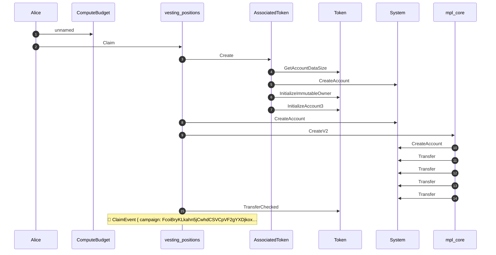
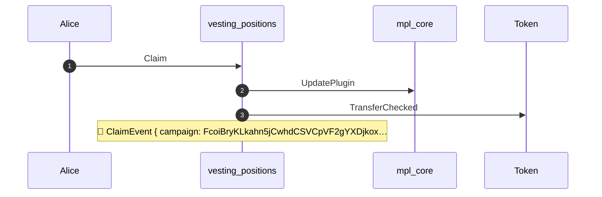
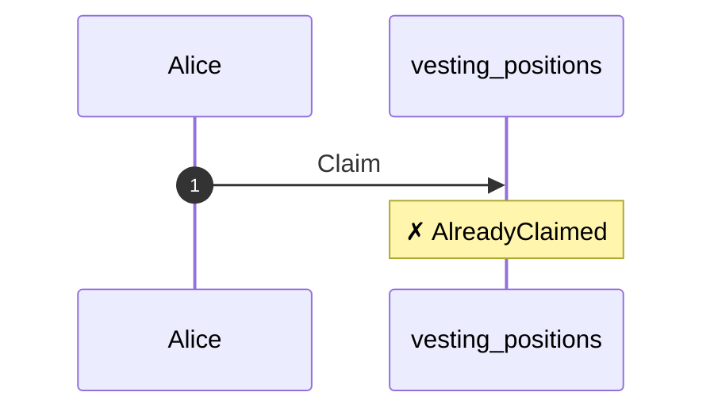
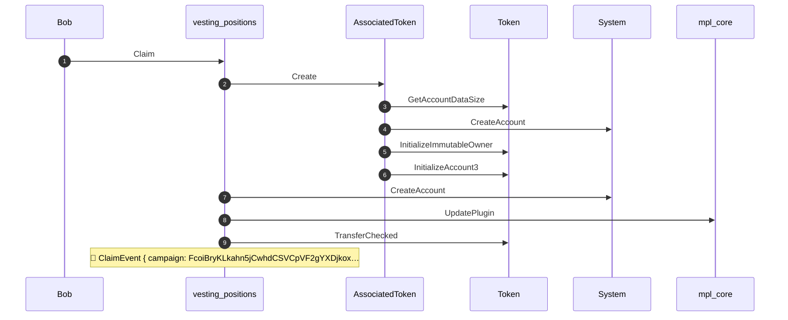

## Full vesting lifecycle — PASS

> demonstrate whole vesting life cycle include position transfers

**actors pubkeys**

| field | value |
|---|---|
| campaign creator | 6KYVjgtDdQFvxG834LVvJV4YMHc6N3t1zn5WeJ4BvcPx |
| alice | 4wQQJM9LNuhinieNAqmHuPCm8LXDTVfhx84P32nAVE9P |
| bob | ErV63ApqLgh1Je5PdiVj6kzwkKJmLjKV41QoN9U4BNag |

### Campaign initialized

**initialization checks**

| field | value |
|---|---|
| creator match | true |
| schedule match | true |
| merkle root match | true |
| total deposit match | true |

- [x] campaign creator match: `true`
- [x] campaign schedule match: `true`
- [x] merkle root and deposit match: `true`

**campaign settings**

| field | value |
|---|---|
| creator | campaign creator |
| start (unix) | 1700086400 |
| end (unix) | 1702678400 |
| grace period (sec) | 604800 |
| cliff duration (sec) | 86400 |
| cliff release (bps) | 1000 |
| total deposit | 10000000000000 |
| transferable | true |

**campaign schedule**

| field | value |
|---|---|
| start | 1700086400 |
| end | 1702678400 |
| grace | 604800 |

### Alice first claim

**Collection & Asset**

| field | value |
|---|---|
| Position NFT (minted by Alice) | 6sNmjE8prKLHbJFUyqfk2n4G7oDFnQMFs6rvk1FNV2US |
| NFT Collection for this campaign | 8CVbrhmc1cCVpxGc5eD6nCyEy1Yrp5K7WZua4Lv91Rdg |

**first claim**

| field | value |
|---|---|
| claimant | Alice |
| whitelisted | true |
| auth | merkle proofs + allocation |
| timestamp (unix) | 1700172800 |
| allocation | 1000000000000 |
| expected release | 100000000000 |

- [x] position nft exists: `true`
- [x] position nft owner is alice: `4wQQJM9LNuhinieNAqmHuPCm8LXDTVfhx84P32nAVE9P`
- [x] cliff release credited (10%): `100000000000`

### Alice subsequent claim

**subsequent claim**

| field | value |
|---|---|
| claimant | Alice |
| auth | position NFT (no proofs) |
| asset | Position NFT (minted by Alice) |
| linear % | 50 |
| timestamp (unix) | 1701425600 |
| balance before | 100000000000 |
| incremental release | 450000000000 |

- [x] additional vesting credited: `550000000000`

### NFT transfer to Bob

**transfer**

| field | value |
|---|---|
| from | Alice |
| to | Bob |
| recipient whitelisted | false |
| asset | Position NFT (minted by Alice) |

- [x] position nft owner is bob: `ErV63ApqLgh1Je5PdiVj6kzwkKJmLjKV41QoN9U4BNag`

### Merkle replay rejected

**attack**

| field | value |
|---|---|
| vector | first claim with valid merkle proofs after transfer |
| goal | mint a second NFT / reclaim allocation (infinite money trick) |
| alice owns nft | false |
| expected error | AlreadyClaimed |

- [x] alice no longer owns the nft: `true`

Alice replays merkle proofs after transferring the NFT; the claim receipt blocks a second position

- [x] claim receipt still bound to alice: `4wQQJM9LNuhinieNAqmHuPCm8LXDTVfhx84P32nAVE9P`

### Bob claims via NFT ownership

**subsequent claim**

| field | value |
|---|---|
| claimant | Bob |
| whitelisted | false |
| asset | 6sNmjE8prKLHbJFUyqfk2n4G7oDFnQMFs6rvk1FNV2US |
| auth | NFT ownership only (no merkle proofs) |
| linear % | 75 |
| timestamp (unix) | 1702052000 |
| claimed so far | 550000000000 |
| expected release | 225000000000 |

Bob was never whitelisted; NFT ownership alone authorizes the subsequent claim

- [x] bob credited without merkle proofs: `225000000000`
- [x] position nft owner is still bob: `ErV63ApqLgh1Je5PdiVj6kzwkKJmLjKV41QoN9U4BNag`

**Structured logs**

````text
### Act 1 — alice first claim
```console
Transaction  signers=[Alice]
├── ComputeBudget [1] ✓ (no cu)
└── vesting_positions::Claim [1] ✓ 183917cu  signer=Alice
    │ 🔔 ClaimEvent
    │      campaign:           FcoiBryKLkahn5jCwhdCSVCpVF2gYXDjkoxcH1vvtj6n,
    │      asset:              Position NFT (minted by Alice),
    │      claimant:           Alice,
    │      original_recipient: Alice,
    │      amount:             100000000000,
    │      claimed_so_far:     100000000000,
    │      timestamp:          1700172800
    ├── AssociatedToken::Create [2] ✓ 20389cu
    │   ├── Token::GetAccountDataSize [3] ✓ 1595cu
    │   ├── System::CreateAccount [3] ✓ (no cu)
    │   ├── Token::InitializeImmutableOwner [3] ✓ 1405cu
    │   └── Token::InitializeAccount3 [3] ✓ 4214cu
    ├── System::CreateAccount [2] ✓ (no cu)
    ├── mpl_core::CreateV2 [2] ✓ 29916cu
    │   ├── System::CreateAccount [3] ✓ (no cu)
    │   ├── System::Transfer [3] ✓ (no cu)
    │   ├── System::Transfer [3] ✓ (no cu)
    │   ├── System::Transfer [3] ✓ (no cu)
    │   └── System::Transfer [3] ✓ (no cu)
    └── Token::TransferChecked [2] ✓ 6174cu
Compute Units (this run): 184067
Legend (3):
  Alice             = 4wQQJM9LNuhinieNAqmHuPCm8LXDTVfhx84P32nAVE9P
  vesting_positions = 7DkU9TQhcN87f2djZDd2MjjPZoXLfnZZj8HhybeZswX1
  mpl_core          = CoREENxT6tW1HoK8ypY1SxRMZTcVPm7R94rH4PZNhX7d
```

### Act 2 — alice subsequent claim
```console
── vesting_positions::Claim ────────────────────────────────
Transaction  signers=[Alice]
└── vesting_positions::Claim [1] ✓ 83989cu  signer=Alice
    │ 🔔 ClaimEvent
    │      campaign:           FcoiBryKLkahn5jCwhdCSVCpVF2gYXDjkoxcH1vvtj6n,
    │      asset:              Position NFT (minted by Alice),
    │      claimant:           Alice,
    │      original_recipient: Alice,
    │      amount:             450000000000,
    │      claimed_so_far:     550000000000,
    │      timestamp:          1701425600
    ├── mpl_core::UpdatePlugin [2] ✓ 20791cu
    └── Token::TransferChecked [2] ✓ 6174cu
Compute Units (this run): 83989
Legend (3):
  vesting_positions = 7DkU9TQhcN87f2djZDd2MjjPZoXLfnZZj8HhybeZswX1
  Alice             = 4wQQJM9LNuhinieNAqmHuPCm8LXDTVfhx84P32nAVE9P
  mpl_core          = CoREENxT6tW1HoK8ypY1SxRMZTcVPm7R94rH4PZNhX7d
```

### Act 3 — merkle replay rejected
```console
── vesting_positions::Claim ────────────────────────────────
Transaction  signers=[Alice]
└── vesting_positions::Claim [1] ✗ 22067cu  signer=Alice
    └── Error: AlreadyClaimed
Error: InstructionError(0, Custom(6012))
Compute Units (this run): 22067
Legend (2):
  vesting_positions = 7DkU9TQhcN87f2djZDd2MjjPZoXLfnZZj8HhybeZswX1
  Alice             = 4wQQJM9LNuhinieNAqmHuPCm8LXDTVfhx84P32nAVE9P
```

### Act 4 — bob claim via nft ownership
```console
── vesting_positions::Claim ────────────────────────────────
Transaction  signers=[Bob]
└── vesting_positions::Claim [1] ✓ 113271cu  signer=Bob
    │ 🔔 ClaimEvent
    │      campaign:           FcoiBryKLkahn5jCwhdCSVCpVF2gYXDjkoxcH1vvtj6n,
    │      asset:              Position NFT (minted by Alice),
    │      claimant:           Bob,
    │      original_recipient: Alice,
    │      amount:             225000000000,
    │      claimed_so_far:     775000000000,
    │      timestamp:          1702052000
    ├── AssociatedToken::Create [2] ✓ 21889cu
    │   ├── Token::GetAccountDataSize [3] ✓ 1595cu
    │   ├── System::CreateAccount [3] ✓ (no cu)
    │   ├── Token::InitializeImmutableOwner [3] ✓ 1405cu
    │   └── Token::InitializeAccount3 [3] ✓ 4214cu
    ├── System::CreateAccount [2] ✓ (no cu)
    ├── mpl_core::UpdatePlugin [2] ✓ 20791cu
    └── Token::TransferChecked [2] ✓ 6174cu
Compute Units (this run): 113271
Legend (3):
  vesting_positions = 7DkU9TQhcN87f2djZDd2MjjPZoXLfnZZj8HhybeZswX1
  Bob               = ErV63ApqLgh1Je5PdiVj6kzwkKJmLjKV41QoN9U4BNag
  mpl_core          = CoREENxT6tW1HoK8ypY1SxRMZTcVPm7R94rH4PZNhX7d
```
````

**Act 1 — alice first claim — CPI sequence**



**Act 2 — alice subsequent claim — CPI sequence**



**Act 3 — merkle replay rejected — CPI sequence**



**Act 4 — bob claim via nft ownership — CPI sequence**


