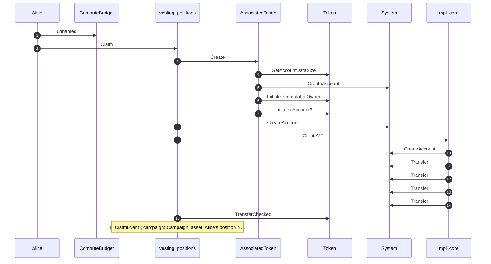
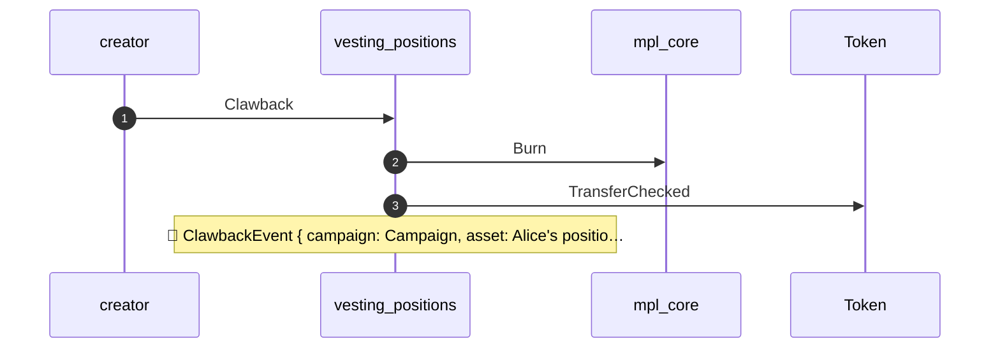
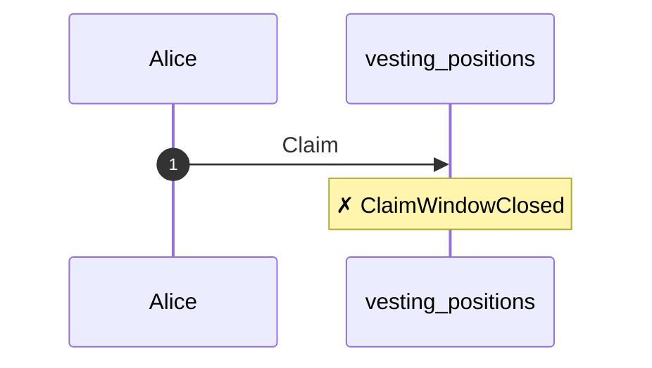

## Vested tokens forfeited past the grace window — PASS

> a fully-vested recipient who is slow to claim keeps nothing of the unclaimed remainder

### Alice claims her cliff, then stops

- [x] Alice received her cliff unlock: `true`

### Campaign end: Alice is fully vested

By campaign end every token has vested. Alice is *entitled* to the whole remaining allocation; the only thing standing between her and it is one more claim instruction she has not yet sent.

- [x] Alice's vested-but-unclaimed remainder (tokens): `900000000000`

### The grace window lapses, and the creator claws back

- [x] Alice keeps only her cliff (the vested remainder is gone): `100000000000`
- [x] the creator recovered exactly Alice's vested remainder: `900000000000`

This test passes: the grace window is the program's design, working as written. The question for review is whether a *vested* entitlement should be forfeitable at all. Alice met every vesting condition; she lost the remainder to a calendar deadline, not to an unmet cliff or an early exit. Many vesting designs make vested tokens claimable indefinitely, so two questions follow: is the forfeiture intended, and is a grace window measured in days long enough to be fair to a recipient who is simply slow?

**Structured logs**

````text
### Act 1 — Alice claims the cliff
```console
Transaction  signers=[Alice]
├── ComputeBudget [1] ✓ (no cu)
└── vesting_positions::Claim [1] ✓ 191417cu  signer=Alice
    │ 🔔 ClaimEvent
    │      campaign:           Campaign,
    │      asset:              Alice's position NFT,
    │      claimant:           Alice,
    │      original_recipient: Alice,
    │      amount:             100000000000,
    │      claimed_so_far:     100000000000,
    │      timestamp:          1700172800
    ├── AssociatedToken::Create [2] ✓ 23389cu
    │   ├── Token::GetAccountDataSize [3] ✓ 1595cu
    │   ├── System::CreateAccount [3] ✓ (no cu)
    │   ├── Token::InitializeImmutableOwner [3] ✓ 1405cu
    │   └── Token::InitializeAccount3 [3] ✓ 4214cu
    ├── System::CreateAccount [2] ✓ (no cu)
    ├── mpl_core::CreateV2 [2] ✓ 29916cu
    │   ├── System::CreateAccount [3] ✓ (no cu)
    │   ├── System::Transfer [3] ✓ (no cu)
    │   ├── System::Transfer [3] ✓ (no cu)
    │   ├── System::Transfer [3] ✓ (no cu)
    │   └── System::Transfer [3] ✓ (no cu)
    └── Token::TransferChecked [2] ✓ 6174cu
Compute Units (this run): 191567
Legend (3):
  Alice             = 4wQQJM9LNuhinieNAqmHuPCm8LXDTVfhx84P32nAVE9P
  vesting_positions = 7DkU9TQhcN87f2djZDd2MjjPZoXLfnZZj8HhybeZswX1
  mpl_core          = CoREENxT6tW1HoK8ypY1SxRMZTcVPm7R94rH4PZNhX7d
```

### Act 2 — the creator claws back Alice's vested remainder
```console
── vesting_positions::Clawback ─────────────────────────────
Transaction  signers=[creator]
└── vesting_positions::Clawback [1] ✓ 87361cu  signer=creator
    │ 🔔 ClawbackEvent
    │      campaign:           Campaign,
    │      asset:              Alice's position NFT,
    │      former_owner:       Alice,
    │      original_recipient: Alice,
    │      amount_recovered:   900000000000,
    │      timestamp:          1703283201
    ├── mpl_core::Burn [2] ✓ 9904cu
    └── Token::TransferChecked [2] ✓ 6174cu
Compute Units (this run): 87361
Legend (3):
  vesting_positions = 7DkU9TQhcN87f2djZDd2MjjPZoXLfnZZj8HhybeZswX1
  creator           = 2sn4P2q4RXTWs67AHYRXStWvTW5Ghk8YFW5EAamKQG8T
  mpl_core          = CoREENxT6tW1HoK8ypY1SxRMZTcVPm7R94rH4PZNhX7d
```

### Act 3 — Alice's late claim is refused
```console
── vesting_positions::Claim ────────────────────────────────
Transaction  signers=[Alice]
└── vesting_positions::Claim [1] ✗ 26397cu  signer=Alice
    └── Error: ClaimWindowClosed
Error: InstructionError(0, Custom(6025))
Compute Units (this run): 26397
Legend (2):
  vesting_positions = 7DkU9TQhcN87f2djZDd2MjjPZoXLfnZZj8HhybeZswX1
  Alice             = 4wQQJM9LNuhinieNAqmHuPCm8LXDTVfhx84P32nAVE9P
```
````

**Act 1 — Alice claims the cliff — CPI sequence**



**Act 2 — the creator claws back Alice's vested remainder — CPI sequence**



**Act 3 — Alice's late claim is refused — CPI sequence**


